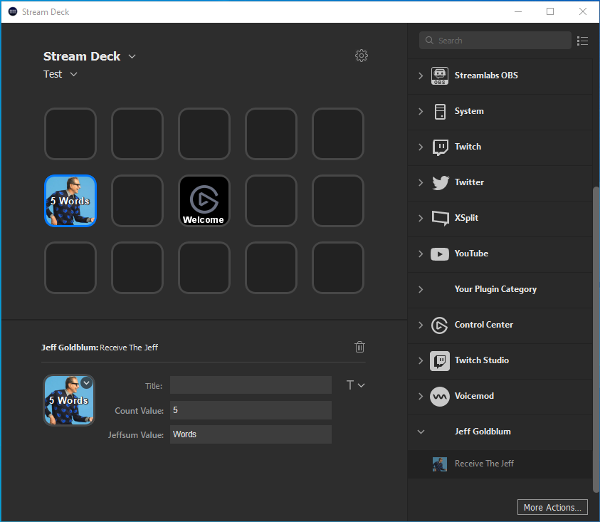
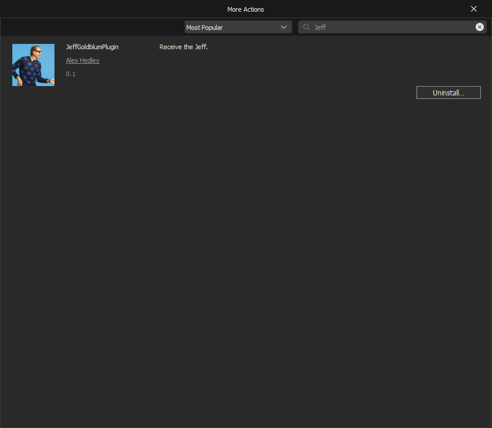
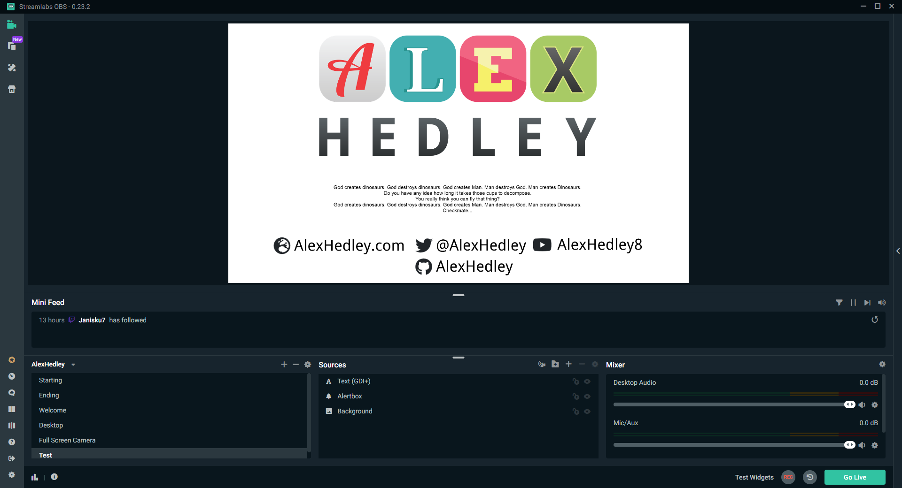

# Jeff Goldblum

Jeff Goldblum Apps

- [Jeff Goldblum SteamDeck Plugin](#jeff-goldblum-steamdeck-plugin)

Coming Soon
- OBS/SLOBS Auto Generator
- VS Extension (on build popup a Jeffsum)? [Win and Mac?]

## Jeff Goldblum SteamDeck Plugin

Jeff Goldblum SteamDeck Plugin built with ([StreamDeckToolkit](https://github.com/FritzAndFriends/StreamDeckToolkit))

Creates a file `C:\Users\<User>\Documents\JeffSum\quote.txt` to use inside OBS.

In the [StreamDeck](https://www.elgato.com/en/gaming/stream-deck) Action configure the type: `Words`, `Quotes`, `Paragraphs` and the number you wish to receive.

Info about the Action

Configure in OBS/StreamLabs

### Built With

- [Jeffsum](https://jeffsum.com/)
  - From [@seanehalpin](https://twitter.com/seanehalpin) - A little text placeholder generator of Jeff Goldblum awesomeness.
- [Jeffsum.NET](https://github.com/jamesmontemagno/Jeffsum.NET)
  - From [@JamesMontemagno](https://github.com/jamesmontemagno/) - Jeff Goldblum text placeholder generator of pure amazingness. (Unofficial .NET version of Jeffsum.com by [@seanehalpin](https://twitter.com/seanehalpin))
